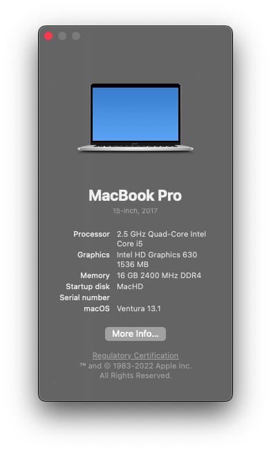

# [SUCCESS] Acer-Nitro5-Hackintosh

If you loved my work, bestow it with a ⭐

# macOS Ventura : version 13.0 Beta 3

The project was made from scratch with the help of [Opencore - Dortania Guide](https://dortania.github.io/OpenCore-Install-Guide/). A huge thanks to the awesome community for the documantation.

`Opencore Version : 0.8.3 Beta` 

## Contents

- [Configuration](#configuration)
- [Current Status](#current-status)
- [DSDT-SSDT](#dsdt-ssdt)
- [Credits](#credits)

## Configuration

| Specifications | Detail                                                  |
| ------------------- | ------------------------------------------- |
| Computer model      | Acer Nitro 5 2018 - AN515-51 (GTX1050ti)   |
| Processor           | Intel Core i5-7300hq ~2.5ghz turbo 3.5ghz  |
| Memory              | HyperX Impact 16GB 2400MHz DDR4 CL14            |
| Hard Disk           | Kingston Q500 480GB SATA3 2.5 SSD          |
| Integrated Graphics | Intel UHD Graphics 630                     |
| Monitor             | FHD 1920x1080 (15.6 inch)     |
| Sound Card          | Realtek ALC255                             |
| Wireless Card       | TP Link TL-WN725N V3 (USB Dongle)|
| Touchpad            | Synaptics I2C HID based                              |

## Current Status
- **Discrete graphic card** never going to work!
- **Touchpad Gestures** works after adding patched DSDT/SSDT (XOSI) in OC
- **Sound** Works perfectly with Layout 31 and ComboJack for headset.
- **HDMI** Won't work, since the port is hardwired to the dGpu (disabled).
- **Everything else works** 

## DSDT-SSDT
- Custom DSDT/SSDT files for this particular model has been created using dumping the DSDT from windows 10 and then modifying it for mac os to work.

> ***Note*** : Please don't use this if you're using a different model, it will definitely cause problem, also kindly remove the kexts RtWlanU.kext and RtWlanU1827.kext from kexts folder and from config.plist [kernel -> Add], these kexts are for usb wifi dongle (tp-link tl-wn725n).

## Credits

- **Special thanks** to [Acidanthera](https://github.com/acidanthera) for providing [AppleALC](https://github.com/acidanthera/AppleALC), [AppleSupportPkg](https://github.com/acidanthera/AppleSupportPkg), [HibernationFixup](https://github.com/acidanthera/HibernationFixup), [Lilu](https://github.com/acidanthera/Lilu), [OpenCorePkg](https://github.com/acidanthera/OpenCorePkg), [VirtualSMC](https://github.com/acidanthera/VirtualSMC), [VoodooPS2](https://github.com/acidanthera/VoodooPS2), and [WhateverGreen](https://github.com/acidanthera/WhateverGreen).
- Thanks to [RehabMan](https://github.com/RehabMan) for providing [SATA-unsupported](https://github.com/RehabMan/hack-tools/tree/master/kexts/SATA-unsupported.kext).
- Thanks to [VoodooI2C](https://github.com/VoodooI2C) for providing [VoodooI2C](https://github.com/VoodooI2C/VoodooI2C).
- Thanks to [hackintosh-stuff](https://github.com/hackintosh-stuff) for providing [ComboJackFix](https://github.com/hackintosh-stuff/ComboJack).
- Thanks to [chris1111](https://github.com/chris1111) for providing the [Wireless USB Driver](https://github.com/chris1111/Wireless-USB-Big-Sur-Adapter).
- A huge thanks to the opencore community, I couldn't stress enough the support I got to make this a success. [Reddit](https://www.reddit.com/r/hackintosh/)
